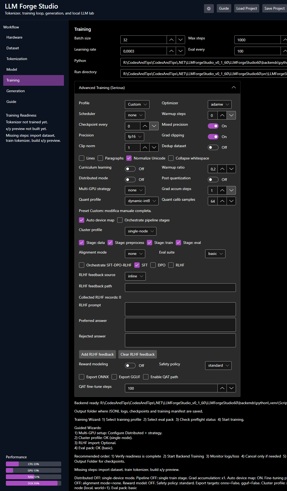

# LLM Forge Studio

Desktop app (**.NET 8 + Avalonia**) for building, fine-tuning, evaluating, and exporting local LLMs with a guided step-by-step workflow.

## Demo Video (Previous Version)
Watch the demo on YouTube: https://youtu.be/s9LBW09kp_8

> **Important validation note (May 14, 2026):**
> Current validation has been completed mainly on **small datasets**.
> **Real multi-GPU and multi-machine cluster tests are not completed yet** and are planned in the next days.
> Since this project is open and free, the community is welcome to test these scenarios and report issues with as much detail as possible (hardware, OS, config, logs, repro steps), so fixes can be shipped quickly.

## v1.0.0 UI Screenshot (Advanced Training)

<a href="docs/images/advanced-training-v1.0.0.png">
  
</a>

## Positioning (v1.0.0)

LLM Forge Studio is designed for serious local experimentation and production-style training flows on accessible hardware.

Core workflow:
`Dataset -> Tokenization -> Model -> Training -> Generation`

It is not intended to reproduce frontier-scale cloud models on consumer machines.

## Platform

- Primary target: **Windows**
- Linux/macOS: supported in manual/experimental mode (backend setup may require manual steps)

## VRAM Reference (Rule-of-Thumb)

The table below is an approximate guide to understand scale/cost.  
Actual VRAM depends on sequence length, batch size, optimizer states, precision, gradient checkpointing, and framework overhead.

| Model Scale | Params | Inference VRAM (FP16, approx) | Training VRAM (FP16 full fine-tune, approx) | Practical Notes |
|---|---:|---:|---:|---|
| Tiny | 10M | `< 1 GB` | `2-4 GB` | Educational/testing scale, very fast iterations. |
| Small | 100M | `1-2 GB` | `8-16 GB` | Entry point for meaningful local experiments. |
| Compact | 500M (0.5B) | `2-4 GB` | `16-40 GB` | Usually needs careful batch/seq tuning. |
| Base | 1B | `4-8 GB` | `32-80 GB` | Common upper limit for many single-GPU users. |
| Medium | 7B | `14-20 GB` | `120-300+ GB` | Training generally requires multi-GPU strategies. |
| Large | 13B | `26-34 GB` | `250-600+ GB` | Full training is typically data-center territory. |
| XL | 70B | `140-180 GB` | `1.4-3.5+ TB` | Requires cluster-scale infra and orchestration. |
| Frontier-class (GPT-5-like, hypothetical) | `>= 1T` (unknown public value) | `2-4+ TB` | `20-50+ TB` | Not realistic for consumer hardware; requires hyperscale systems. |

Quick interpretation:
- For local serious use, scales up to `~0.5B-1B` are the most realistic target range.
- Beyond that, distributed training and large budgets become the dominant constraint.

## What You Can Do

- Import datasets from file/folder, clean and deduplicate data
- Train tokenizers (including Byte-level BPE / Unigram / WordPiece options)
- Configure model and training with guided defaults
- Run training with advanced options (optimizer, scheduler, checkpointing, mixed precision, curriculum, distributed foundations)
- Orchestrate fine-tuning stages (SFT / DPO / RLHF foundations)
- Run eval suites (`quick-5`, `standard-10`, `full-20`) and release-gate artifacts
- Export/convert artifacts (quantization profiles, ONNX/GGUF export paths)
- Save/load complete projects and trace UI training actions with debug logs

## Validation and Roadmap ( Test multi-gpu and cluster following the VALIDATION CHECKLIST)

- Implementation roadmap: [ROADMAP.md](ROADMAP.md)
- Manual validation steps: [RELEASE_VALIDATION_CHECKLIST.md](RELEASE_VALIDATION_CHECKLIST.md)
- Current release summary: [RELEASE_NOTES_v1.0.0.md](RELEASE_NOTES_v1.0.0.md)

## Project Structure

- `src/LLMForgeStudio.App`: Avalonia UI + C# core services
- `backends/python`: Python training/generation backend
- `tests/LLMForgeStudio.App.Tests`: core tests
- `samples/validation`: sample datasets for validation runs

## Run From Source

```bash
dotnet restore
dotnet run --project src/LLMForgeStudio.App
```

## Python Backend Setup ( Optional, the software includes an automated setup )

```bash
cd backends/python
python -m venv .venv
# Windows
.venv\Scripts\activate
# Linux/macOS
source .venv/bin/activate
pip install -r requirements.txt
```

Then in **Training**:
- set `Python` interpreter path (example: `.venv\Scripts\python.exe`)
- set `Run directory`
- start backend training

## Windows Build

Run from GitHub release artifact, or build locally:

```bash
dotnet publish src/LLMForgeStudio.App/LLMForgeStudio.App.csproj -c Release -r win-x64 --self-contained true /p:PublishSingleFile=true /p:IncludeNativeLibrariesForSelfExtract=true
```

Output:

```text
src/LLMForgeStudio.App/bin/Release/net8.0/win-x64/publish/LLMForgeStudio.App.exe
```
