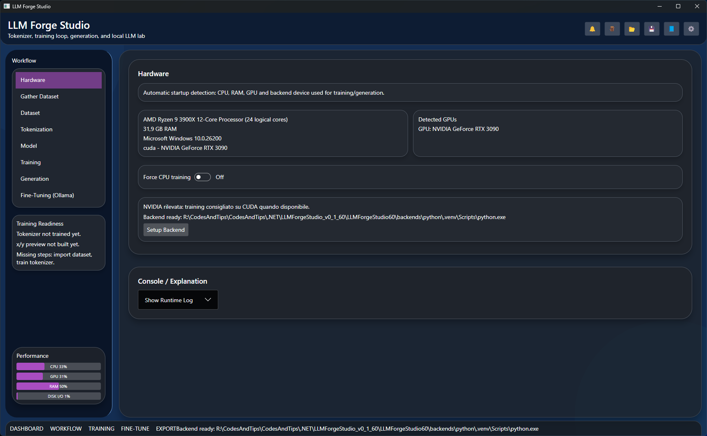
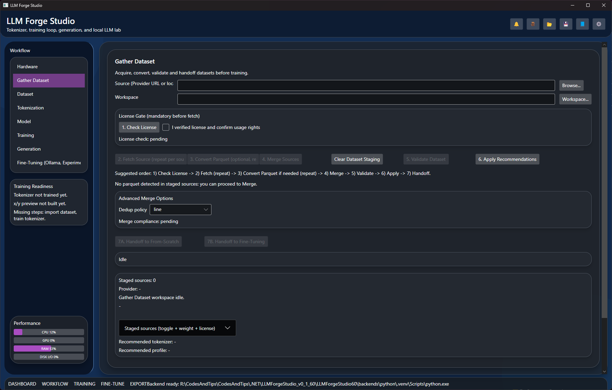
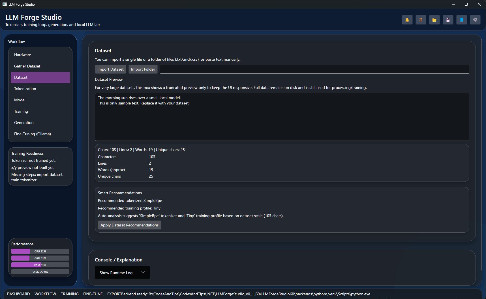
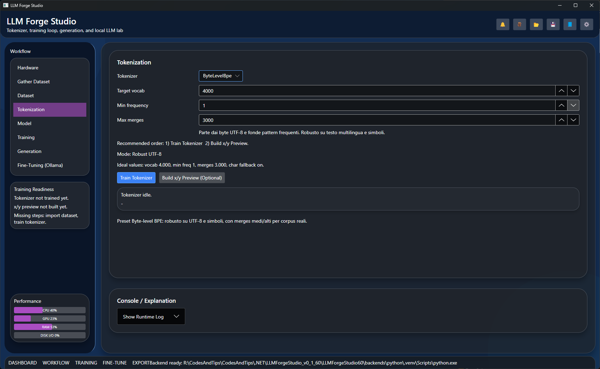
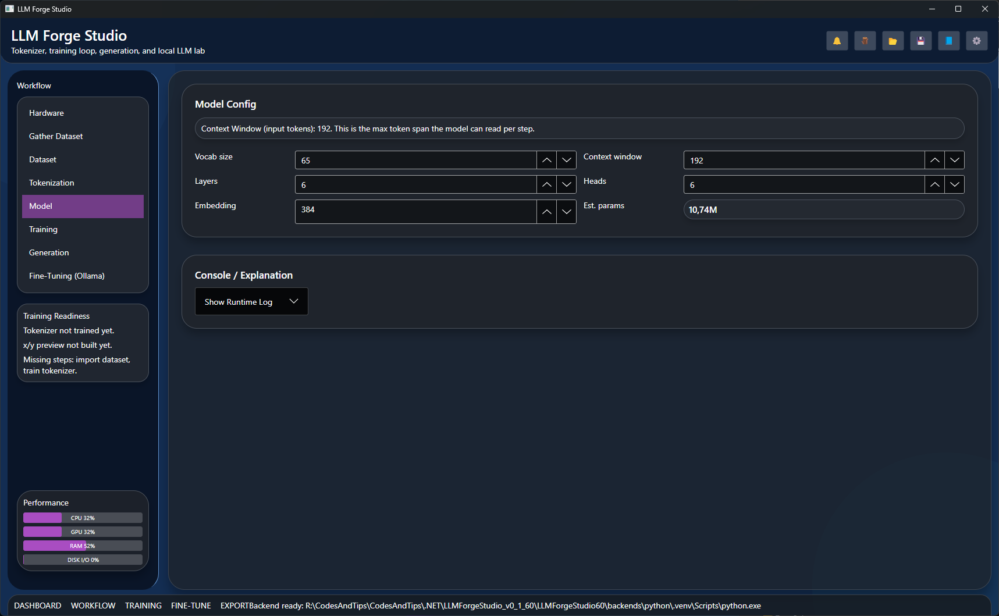
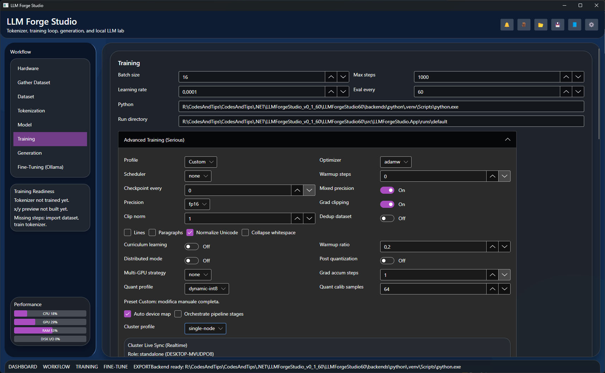
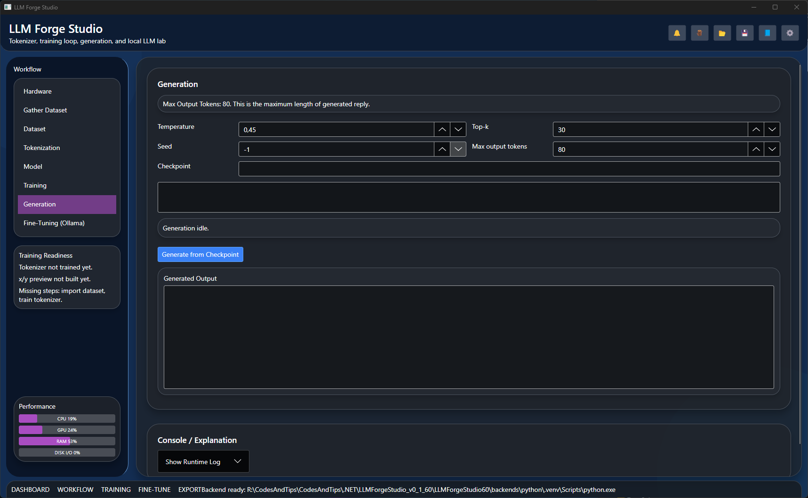
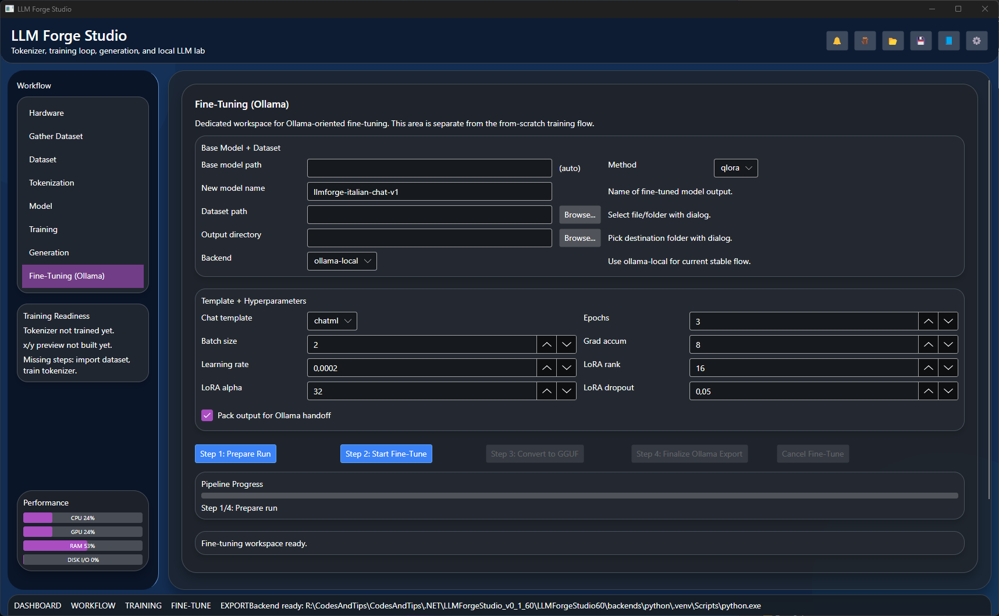

# LLM Forge Studio Local LLM From Scratch End-to-End Builder

Open-source desktop app (**.NET 8 + Avalonia + Python backend**) to build, train, fine-tune, evaluate, and export local LLMs with a guided end-to-end workflow from dataset to Ollama-ready handoff.

> **Current Version:** `v1.0.4`  
> **Release Date:** `2026-05-17`
> **Status:** `Beta (Experimental)`  
> This project is actively evolving and may include unstable behaviors on some workflows/hardware combinations.

## Experimental Reality Check

Even with guided defaults and built-in automation, high-quality model outcomes are still a hard engineering task.

- Getting strong results is often **complex and iterative**.
- You may need **many runs**, parameter adjustments, and dataset refinements.
- Better outcomes usually require **more time**, **more hardware headroom**, and **careful validation**.
- LLM Forge Studio simplifies the workflow, but it does not remove the intrinsic difficulty of model training.

## Project Size Snapshot

- Total files (project scope): `197`
- Total lines (absolute, all text files in scope): `19,010`
- Total lines (manual/editable): `19,010`
- Total lines (auto-generated): `0`

Counting note:
- Scope includes `samples/`.
- Scope excludes runtime/build/output folders such as `.git`, `bin`, `obj`, `runs`, `.venv`, `.vs`, and common output directories (`publish`, `artifacts`, `dist`, `out`).
- “Absolute lines” counts all physical lines across text files in scope.
- “Manual/editable lines” excludes files detected as auto-generated.
- “Auto-generated lines” includes files marked by common generated-code signals (filename markers such as `.g.cs` / `.Designer.cs` or auto-generated headers). In current scoped tree, this count is `0`.

## What Is LLM Forge Studio

LLM Forge Studio is a local LLM training platform for creators and developers who want a practical **from-scratch** and **end-to-end** pipeline without cloud lock-in.

Core workflow:
`Gather Dataset -> Tokenization -> Model -> Training -> Fine-Tuning (Ollama, Experimental) -> GGUF -> Finalize`

Primary use cases:
- Build small-to-medium local language models from your own datasets
- Run guided fine-tuning flows with clear stage gating and artifacts
- Export finalized bundles for local inference and validation in Ollama
- Keep deterministic logs/manifests for reproducibility and release checks

## Keywords

`local llm` `llm from scratch` `end to end llm pipeline` `ollama fine tuning` `gguf export` `dataset to model workflow` `open source llm trainer` `avalonia dotnet ai desktop app`

> **Important validation note (May 14, 2026):**
> Current validation has been completed mainly on **small datasets**.
> **Real multi-GPU and multi-machine cluster tests are not completed yet** and are planned in the next days.
> Since this project is open and free, the community is welcome to test these scenarios and report issues with as much detail as possible (hardware, OS, config, logs, repro steps), so fixes can be shipped quickly.

## v1.0.4 UI Gallery (Click to Expand)

| Hardware | Gather Dataset | Dataset | Tokenization |
|---|---|---|---|
| <a href="docs/images/ui-01-hardware.png"></a> | <a href="docs/images/ui-02-gather-dataset_v2.png"></a> | <a href="docs/images/ui-03-dataset.png"></a> | <a href="docs/images/ui-04-tokenization.png"></a> |

| Model | Training | Generation | Fine-Tuning (Ollama, Experimental) |
|---|---|---|---|
| <a href="docs/images/ui-05-model.png"></a> | <a href="docs/images/ui-06-training.png"></a> | <a href="docs/images/ui-07-generation.png"></a> | <a href="docs/images/ui-08-fine-tuning-ollama.png"></a> |

## Demo Video (Previous Version v0.x.x)
Watch the demo on YouTube: https://youtu.be/s9LBW09kp_8

## Positioning

LLM Forge Studio is designed for serious local experimentation and production-style training flows on accessible hardware. It is not intended to reproduce frontier-scale cloud models on consumer machines.

## Platform

- Primary target: **Windows**
- Linux/macOS: supported in manual/experimental mode (backend setup may require manual steps)

## VRAM Reference (Rule-of-Thumb)

The table below is an approximate guide to understand scale/cost.  
Actual VRAM depends on sequence length, batch size, optimizer states, precision, gradient checkpointing, and framework overhead.

| Model Scale | Params | Inference VRAM (FP16, approx) | Training VRAM (FP16 full fine-tune, approx) | Practical Notes |
|---|---:|---:|---:|---|
| Tiny | 10M | `< 1 GB` | `2-4 GB` | Educational/testing scale, very fast iterations. |
| Small | 100M | `1-2 GB` | `8-16 GB` | Entry point for meaningful local experiments. |
| Compact | 500M (0.5B) | `2-4 GB` | `16-40 GB` | Usually needs careful batch/seq tuning. |
| Base | 1B | `4-8 GB` | `32-80 GB` | Common upper limit for many single-GPU users. |
| Medium | 7B | `14-20 GB` | `120-300+ GB` | Training generally requires multi-GPU strategies. |
| Large | 13B | `26-34 GB` | `250-600+ GB` | Full training is typically data-center territory. |
| XL | 70B | `140-180 GB` | `1.4-3.5+ TB` | Requires cluster-scale infra and orchestration. |
| Frontier-class (GPT-5-like, hypothetical) | `>= 1T` (unknown public value) | `2-4+ TB` | `20-50+ TB` | Not realistic for consumer hardware; requires hyperscale systems. |

Quick interpretation:
- For local serious use, scales up to `~0.5B-1B` are the most realistic target range.
- Beyond that, distributed training and large budgets become the dominant constraint.

## What You Can Do

- Import datasets from file/folder, clean and deduplicate data
- Train tokenizers (including Byte-level BPE / Unigram / WordPiece options)
- Configure model and training with guided defaults
- Run training with advanced options (optimizer, scheduler, checkpointing, mixed precision, curriculum, distributed foundations)
- Monitor cluster/sharedfs runtime through a live sync panel (node heartbeat, queue counters, and remote GPU telemetry when reported)
- Orchestrate fine-tuning stages (SFT / DPO / RLHF foundations)
- Run eval suites (`quick-5`, `standard-10`, `full-20`) and release-gate artifacts
- Export/convert artifacts (quantization profiles, ONNX/GGUF export paths)
- Save/load complete projects and trace UI training actions with debug logs

## Permissive Dataset Links (Community)

Here is a larger provider list focused on permissive-license discovery and practical Gather usage.

- Hugging Face (MIT filter): https://huggingface.co/datasets?license=license%3Amit
- Hugging Face (Apache-2.0 filter): https://huggingface.co/datasets?license=license%3Aapache-2.0
- Hugging Face (CC0 filter): https://huggingface.co/datasets?license=license%3Acc0-1.0
- GitHub repositories (MIT + dataset keyword): https://github.com/search?q=dataset+license%3Amit&type=repositories
- GitHub repositories (Apache-2.0 + dataset keyword): https://github.com/search?q=dataset+license%3Aapache-2.0&type=repositories
- Zenodo (open datasets portal): https://zenodo.org/search?page=1&size=20&type=dataset
- OpenML datasets: https://www.openml.org/search?type=data
- UCI Machine Learning Repository: https://archive.ics.uci.edu/
- Data.gov catalog: https://catalog.data.gov/dataset

Community note:
- Always verify the final dataset license on the dataset card before use.
- In the current Gather flow, Hugging Face and GitHub have remote license checks; other providers can be staged via direct links/files with manual rights acknowledgement.

## Validation and Roadmap

- Implementation roadmap: [ROADMAP.md](ROADMAP.md)
- Manual validation steps: [RELEASE_VALIDATION_CHECKLIST.md](RELEASE_VALIDATION_CHECKLIST.md)
- Current release summary: [RELEASE_NOTES_v1.0.4.md](RELEASE_NOTES_v1.0.4.md)
- Future draft notes: [RELEASE_NOTES_v1.0.5_FUTURE_DRAFT.md](RELEASE_NOTES_v1.0.5_FUTURE_DRAFT.md)
- Archived release notes: [OLD_RELEASES_NOTES](OLD_RELEASES_NOTES)
- SEO/discoverability setup playbook: [GITHUB_SEO_PROFILE.md](GITHUB_SEO_PROFILE.md)

## Optional Attribution (No Obligation)

LLM Forge Studio is free and open source under the MIT license.

If this project helps you and performs well for your use case, a voluntary mention is always appreciated:
- reference the project name and repository link
- optionally mention the author/maintainer

This is gratitude-only and never a usage requirement.

## Local Test Timing Log

Runtime timing depends on hardware/backend/configuration.  
This table tracks real user-reported timings for quick comparison and future tuning.

| Date | Dataset | Rows | Approx Size | Step | Time | Hardware Note |
|---|---|---:|---:|---|---|---|
| 2026-05-17 | `samples/validation/it_quick_chat_6k/train.jsonl` | 6,000 | ~2.6 MB | Tokenizer training | ~2m 50s | CPU-bound tokenization run, 32GB RAM |
| 2026-05-17 | `samples/validation/it_chat_conversation_4k/train.jsonl` | 4,000 | ~TBD | Tokenizer training | pending re-test | Replaced old 10k sample due to high template repetition; re-benchmark in progress |

## Project Structure

- `src/LLMForgeStudio.App`: Avalonia UI + C# core services
- `backends/python`: Python training/generation backend
- `tests/LLMForgeStudio.App.Tests`: core tests
- `samples/validation`: sample datasets for validation runs

## Run From Source

```bash
dotnet restore
dotnet run --project src/LLMForgeStudio.App
```

## Python Backend Setup ( Optional, the software includes an automated setup )

```bash
cd backends/python
python -m venv .venv
# Windows
.venv\Scripts\activate
# Linux/macOS
source .venv/bin/activate
pip install -r requirements.txt
```

Then in **Training**:
- set `Python` interpreter path (example: `.venv\Scripts\python.exe`)
- set `Run directory`
- start backend training

### Ollama Export Bundle (Post-Training)

If `Export GGUF` is enabled, after training the app prepares:

```text
<run-directory>/exports/ollama
```

This folder is a manual handoff bundle (`model.gguf`, `Modelfile`, status/notes files).  
The app does not write directly to Ollama internal `blobs/manifests` storage.

## Automated E2E Suite (Scenario Pack)

You can run a full artifact gate check over one or more completed runs:

```bash
python3 backends/python/e2e_release_gate.py --scenario-pack samples/validation/e2e_scenarios/quick_suite.json --output-dir runs/default/e2e_gate_suite
```

Generated artifacts:
- `e2e_suite_summary.json`
- `e2e_suite_summary.md`
- per-scenario reports in subfolders

## Windows Build

Run from GitHub release artifact, or build locally:

```bash
dotnet publish src/LLMForgeStudio.App/LLMForgeStudio.App.csproj -c Release -r win-x64 --self-contained true /p:PublishSingleFile=true /p:IncludeNativeLibrariesForSelfExtract=true
```

Output:

```text
src/LLMForgeStudio.App/bin/Release/net8.0/win-x64/publish/LLMForgeStudio.App.exe
```
